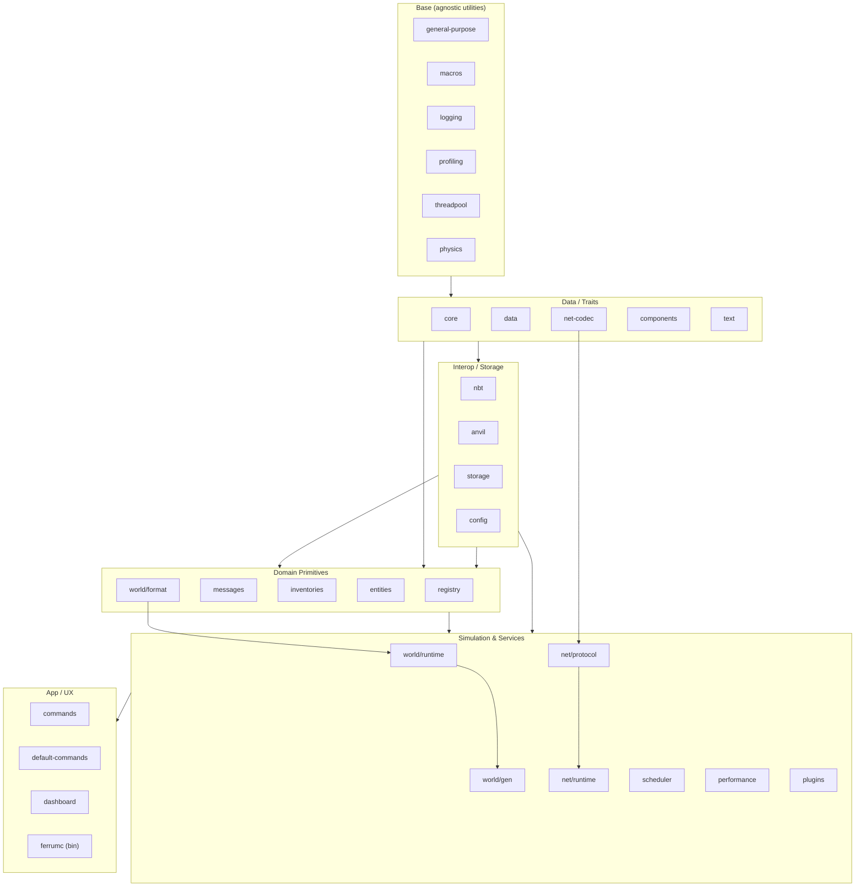
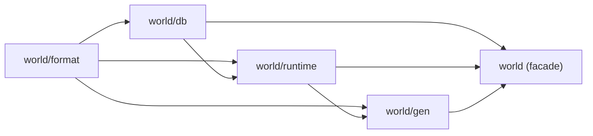
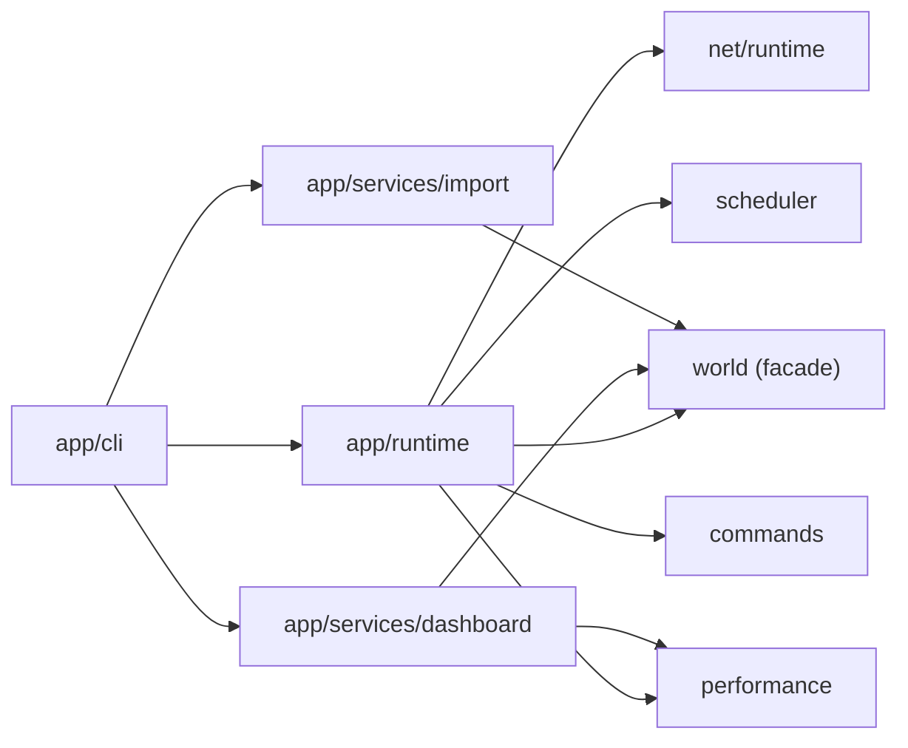

# Refactor plan: crate layout and dependency graph

This is a proposed, code-neutral reorganization of the workspace to push data/trait crates to the bottom, keep game-agnostic infra lower in the tree, and group gameplay logic higher up. The goal is to simplify the dependency graph while keeping compatibility paths clear.

## Design goals

- Make data/trait and serialization crates leaf-leaning: `core`, `components`, `net-codec`, basic math/physics, and data models should not depend on gameplay.
- Isolate interop/storage so it can be reused: NBT/Anvil adapters, storage, and config belong below world/runtime logic.
- Give world a clear internal hierarchy: chunk format separated from generation and DB plumbing; a top-level world facade re-exports the pieces.
- Keep networking stratified: codec/encryption -> protocol definitions -> connection/runtime.
- Favor narrow, directional dependencies (facades depend on internals, not vice versa).

## Proposed layered structure (simplified)



## World stack reshuffle

- Create a `world` directory with subcrates:
  - `world/format`: chunk/column types, block palettes, coordinate math, serialization traits for chunk data, adapters to/from NBT/Anvil (only via traits, not storage).
  - `world/db`: persistence helpers that wrap `ferrumc-storage` for chunk/region schemas; no gameplay logic, just storage models and migrations.
  - `world/runtime`: chunk manager, ticketing/loading, ticking hooks, lighting, entity lookup within chunks; depends on `format` and `db`, optionally `threadpool`.
  - `world/gen`: generation pipeline; depends on `world/format`, can optionally use `world/runtime` helpers for chunk assembly.
  - `world` (facade crate): re-exports the above, owns configuration and high-level APIs for the rest of the server.



## Networking stratification

- Keep `net-codec` as the packet/model encoder/decoder and shared protocol constants.
- Keep `net-encryption` as a crypto helper with no higher-level dependencies.
- Split `net` into:
  - `net/protocol`: packet/state definitions, traits for connection handlers, login/status/play state machines (depends on `net-codec`, `core`, `components`, `messages`).
  - `net/runtime`: socket/server runtime, compression thresholds, player connection lifecycle, bridges to world/runtime (depends on `net/protocol`, `world` facade, `scheduler`, `performance`).
- `commands` and gameplay systems consume `net/protocol` types rather than `net/runtime` where possible to avoid tight coupling.

## Storage & interop placement

- Move storage and adapters lower:
  - `storage` should depend only on base/data crates (`core`, `data`, `nbt` for typed blobs) and expose generic engines (heed-backed, tempfs).
  - `nbt` and `anvil` sit beside `storage` as pure adapters/formatters with no gameplay dependencies.
  - `config` stays low; consumers should read config via their own thin domain config structs.

## Data/trait crates (bottom)

- `core`: ECS-facing traits, shared error types, IDs, and math aliases; no world/net/game specifics.
- `data`: immutable data tables (block/item metadata), serde structs for external specs.
- `components`: ECS components and tags; should only depend on `core`, `data`, `net-codec`, `config` (for defaults), and maybe `physics` for vectors.
- `messages`: pure data for cross-system events; avoid pulling in world/net runtime.
- `physics`: math utilities, collision primitives; avoid world-specific storage.

## Domain and systems (mid/high)

- `registry`: registries built from `data` and `components`; feeds world/runtime and net/protocol.
- `inventories`: inventory model/logic; depends on `components`, `data`, optionally `nbt` for persistence.
- `entities`: entity factory definitions and common behaviors; depends on `components`, `messages`, `world/format`.
- `scheduler`: ECS schedule builders and task orchestration; no hard dependency on world internals, just traits/hooks.
- `performance`: telemetry/metrics; consumed by runtime and dashboard.
- `plugins`: WASM/FFI host interfaces; should depend only on protocol-level crates and `world` facade APIs, not internals.

## App layer

- Gameplay command pack (`commands`, formerly `default-commands`): depends on `command-core`, `world` facade, `net/protocol` (avoid `net/runtime` if possible), and other gameplay crates; lives with gameplay logic.
- `dashboard`: optional feature on top of `performance`, `config`, and world facade querying.
- Binary (`src/bin`): wiring only; construct services from facades, not internals. Consider splitting binary setup into smaller crates so systems/listeners stay modular:
  - `app/cli`: CLI parsing, config loading, feature flag wiring.
  - `app/runtime`: server startup glue that composes world/runtime, net/runtime, scheduler, performance.
  - `app/services/*` (optional): feature-specific bootstraps (e.g., import, dashboard, profiling, plugin host). Each consumes only messages/facades, never peers directly.



## Rationalizing scattered crates

- **Utils cluster**: consolidate `utils`, `general-purpose`, `logging`, `profiling`, and `threadpool` under a single `base` namespace (e.g., `base/logging`, `base/profiling`, `base/threading`). Keep `macros` adjacent. This reduces cross-crate churn and puts foundational utilities in one place.
- **Config duplication**: today `config` lives in `src/lib/config` and `src/lib/utils/config`. Collapse to one `config` crate with feature flags for dashboards, CLI defaults, etc.; expose minimal trait-based loaders used by higher crates.
- **Instrumentation**: pair `performance` with `profiling` in an `instrumentation` group. `dashboard` depends on this group, not directly on runtime internals.
- **Data vs. registries**: keep `registry` thin and fed only by `data` + `components`; avoid it depending on runtime/world so that it can stay low-level.
- **Physics/particles/entities**: keep `physics` low (math/collision only). Let `particles` depend on `world/format` + `components` but not on `world/runtime` to keep rendering/logical effects decoupled.
- **Derive macros**: restrict `derive_macros` to operate on data/format/components traits; avoid embedding runtime assumptions. If needed, split into `macros/data` and `macros/runtime` to keep the low-level set usable by foundational crates.
- **Commands split/rename**:
  - Keep a low-layer infra crate renamed to `command-core` (or `command-runtime`): command registry, parsing, dispatch traits, and error types. Depends only on `core`, `components`, `messages`, `text`, and `net/protocol` types—not on gameplay systems.
  - Rename `default-commands` ➝ `commands` and treat it as a gameplay-level pack of Bevy systems; it lives alongside other gameplay crates (world-facing, entities, inventories) and consumes `command-core` traits plus facades.
  - Downstream consumers import infra via `command-core`; gameplay packs (including `commands`) register with the dispatcher in app wiring. Keep feature flags to include/exclude packs.
- **Storage adapters**: move anvil/nbt binding helpers into `world/format` or `storage` feature flags rather than separate ad-hoc helpers in higher crates.

## Proposed directory layout (illustrative)

```
ferrumc/
├─ Cargo.toml                 # workspace root
├─ src/
│  ├─ base/                   # foundational utils, no gameplay deps
│  │  ├─ macros/
│  │  ├─ logging/
│  │  ├─ profiling/
│  │  ├─ threading/           # threadpool/executor helpers
│  │  └─ general/             # general-purpose utils
│  ├─ core/                   # traits, ids, errors
│  ├─ data/                   # immutable data tables/specs
│  ├─ physics/                # math/collision primitives
│  ├─ net/
│  │  ├─ crates/
│  │  │  ├─ codec/            # packet codec/constants
│  │  │  └─ encryption/       # crypto helpers
│  │  ├─ protocol/            # protocol states, packet models
│  │  └─ runtime/             # socket/io runtime
│  ├─ storage/                # generic db (lmdb, sqlite)
│  ├─ adapters/
│  │  ├─ nbt/                 # NBT adapter
│  │  └─ anvil/               # Anvil adapter
│  ├─ config/                 # config loading/traits
│  ├─ text/                   # text/locale helpers
│  ├─ components/             # ECS components/tags
│  ├─ messages/               # cross-system event types
│  ├─ registry/               # registries built from data/components
│  ├─ inventories/            # inventory logic/models
│  ├─ entities/               # entity definitions
│  ├─ command-core/           # command infra (parser/dispatch traits)
│  ├─ world/
│  │  ├─ format/              # chunk/coord/palette types, serde
│  │  ├─ db/                  # chunk/region persistence helpers
│  │  ├─ runtime/             # chunk manager, ticking
│  │  ├─ gen/                 # world generation pipeline
│  │  └─ (facade crate root)  # re-exports + config
│  ├─ commands/               # gameplay command pack (systems)
│  ├─ plugins/                # FFI host
│  ├─ scheduler/              # ECS schedule wiring
│  ├─ performance/            # metrics/telemetry
│  ├─ particles/              # particle logic (no world runtime deps)
│  ├─ dashboard/              # web/dashboard feature
│  ├─ gameplay/               # gameplay systems (Bevy systems grouped by domain)
│  │  ├─ player/              # player lifecycle, movement, input, packet handlers
│  │  ├─ world/               # world-facing systems (loading hooks, ticking bridges)
│  │  ├─ combat/              # damage, status effects
│  │  ├─ background/          # autosave, maintenance tasks
│  │  └─ integration/         # glue systems between commands/messages and gameplay
│  ├─ app/                    # binary composition layer
│  │  ├─ cli/                 # clap args, config merge, feature flags
│  │  ├─ runtime/             # server startup glue; wiring of facades
│  │  └─ services/            # optional entrypoints:
│  │     ├─ import/           # world import bootstrap
│  │     ├─ dashboard/        # dashboard server bootstrap
│  │     ├─ profiling/        # profiling server/hooks
│  │     └─ plugins/          # plugin host bootstrap
│  └─ bin/                    # binary main using app/*
├─ tests/                     # integration tests
└─ scripts/, assets/, configs/, docs/
```

### Gameplay logic placement (systems)

- Create a `gameplay` crate (or module namespace) holding Bevy systems organized by domain (player, world bridges, combat, economy, background). This keeps logic out of `bin` and clearly separated from infra.
- `player` systems: login/logout hooks, movement validation, input handling, interaction dispatch; consumes `net/protocol`, `world` facade, `entities`, `inventories`, `messages`.
- `world` systems: chunk load/unload hooks, block updates, lighting triggers; consume `world/runtime` and publish messages.
- `background` systems: autosave, periodic cleanups, watchdogs; consume `scheduler`, `world/db`, `performance`.
- `integration` systems: connect `command-core` handlers to gameplay actions, translate messages/events into system triggers.
- Keep the binary (`bin` + `app/runtime`) focused on wiring: instantiate facades, register gameplay systems, configure schedules. All domain rules live in `gameplay`.

## Migration outline (no code changes yet)

- Lay out new folders/crates (`world/format`, `world/db`, `world/runtime`, `world/gen`, `world` facade; `net/protocol`, `net/runtime`) and update workspace membership.
- Move chunk structs/serialization from `world` into `world/format`; move DB adapters into `world/db`; move tick/loading managers into `world/runtime`; keep only re-exports and config in the facade.
- Move world-gen logic into `world/gen` and depend on `world/format` (and optionally `world/runtime` for helpers).
- Adjust `net` contents: packet/state types into `net/protocol`; connection handling and I/O into `net/runtime`.
- Refine dependencies: ensure `storage`, `nbt`, `anvil` no longer depend on world or gameplay crates; refactor callers to consume them via traits/APIs.
- Tighten `components/messages/entities` to avoid `world`/`net` runtime; rely on traits and data crates.
- Update feature flags and re-export paths so downstream crates import from the new facades, keeping public API stable.
- Add integration tests (later) at the facade level (world, net/runtime, commands) to validate the reorganized graph without exposing internals.

## Compatibility notes to watch during the move

- Bevy ECS type/feature usage: keep `bevy_ecs` only where systems run; data crates should stay free of ECS dependencies.
- Serialization formats: centralize serde/bitcode derivations in data/format crates to avoid duplicate derives across layers.
- Async runtimes: maintain `tokio` usage only in runtime/service crates (net runtime, world runtime, commands that are async); avoid leaking it into data/trait crates.
- Ensure DB schemas remain stable when moving into `world/db`; keep migration helpers close to schema definitions.
- Re-export strategy: keep `pub use` shims in facade crates to avoid large-scale import churn for consumers while the code moves.
